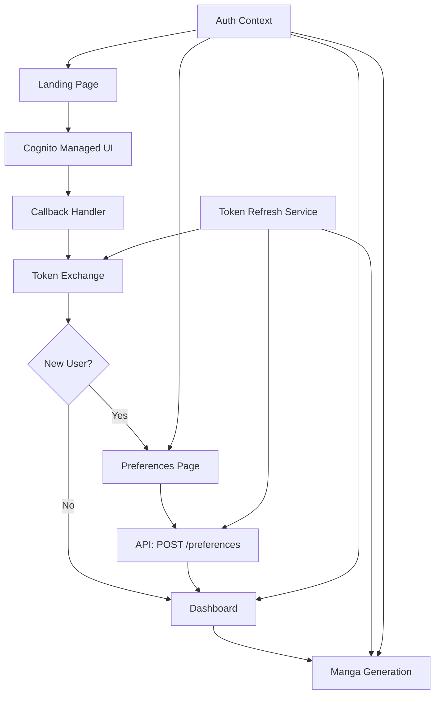

# Design Document

## Overview

The frontend authentication flow for the Griot manga platform is a comprehensive Next.js application that provides seamless user authentication, preferences collection, and access to manga generation features. The system integrates with AWS Cognito for authentication management and the existing API infrastructure for user preferences and content generation.

The application follows a modern React architecture with TypeScript and Tailwind CSS, implementing secure token management, automatic token refresh, and responsive design patterns. The flow guides users from initial landing through authentication, preferences setup, and into the main dashboard experience.

## Architecture

### High-Level Architecture



### Technology Stack

- **Framework**: Next.js 15.4.4 with App Router
- **Language**: TypeScript
- **Styling**: Tailwind CSS v4
- **Authentication**: AWS Cognito with OAuth 2.0/OIDC
- **State Management**: React Context API
- **HTTP Client**: Fetch API with custom wrapper
- **Storage**: Browser localStorage/sessionStorage
- **Routing**: Next.js App Router with middleware

### Directory Structure

```
griot-frontend/
├── src/
│   ├── app/
│   │   ├── (auth)/
│   │   │   ├── callback/
│   │   │   │   └── page.tsx
│   │   │   └── logout/
│   │   │       └── page.tsx
│   │   ├── (protected)/
│   │   │   ├── dashboard/
│   │   │   │   └── page.tsx
│   │   │   └── preferences/
│   │   │       └── page.tsx
│   │   ├── globals.css
│   │   ├── layout.tsx
│   │   ├── page.tsx (Landing)
│   │   └── middleware.ts
│   ├── components/
│   │   ├── auth/
│   │   ├── ui/
│   │   └── layout/
│   ├── contexts/
│   │   └── AuthContext.tsx
│   ├── hooks/
│   │   ├── useAuth.ts
│   │   └── useApi.ts
│   ├── lib/
│   │   ├── auth.ts
│   │   ├── api.ts
│   │   └── utils.ts
│   └── types/
│       ├── auth.ts
│       └── api.ts
```

## Components and Interfaces

### Authentication Context

The authentication system is built around a React Context that manages user state, tokens, and authentication flows.

```typescript
interface AuthContextType {
  user: User | null;
  isAuthenticated: boolean;
  isLoading: boolean;
  login: () => void;
  logout: () => void;
  refreshTokens: () => Promise<boolean>;
  hasValidTokens: () => boolean;
}

interface User {
  id: string;
  email: string;
  username: string;
  hasPreferences: boolean;
}

interface TokenSet {
  accessToken: string;
  idToken: string;
  refreshToken: string;
  expiresAt: number;
}
```

### API Client

A centralized API client handles all HTTP requests with automatic token management and error handling.

```typescript
interface ApiClient {
  get<T>(endpoint: string): Promise<T>;
  post<T>(endpoint: string, data: any): Promise<T>;
  put<T>(endpoint: string, data: any): Promise<T>;
  delete<T>(endpoint: string): Promise<T>;
}

interface ApiResponse<T> {
  success: boolean;
  message: string;
  data: T;
  requestId: string;
  timestamp: string;
}

interface ApiError {
  code: string;
  message: string;
  details?: any;
  requestId: string;
  timestamp: string;
}
```

### Preferences Interface

```typescript
interface UserPreferences {
  genres: string[];
  themes: string[];
  artStyle: ArtStyle;
  targetAudience: TargetAudience;
  contentRating: ContentRating;
}

type ArtStyle =
  | "Traditional"
  | "Modern"
  | "Minimalist"
  | "Detailed"
  | "Cartoon"
  | "Realistic"
  | "Chibi"
  | "Dark"
  | "Colorful"
  | "Black and White";
type TargetAudience =
  | "Children"
  | "Teens"
  | "Young Adults"
  | "Adults"
  | "All Ages";
type ContentRating = "G" | "PG" | "PG-13" | "R";
```

### Component Architecture

#### Landing Page Component

- Hero section with platform branding
- Feature highlights
- Authentication buttons (Sign Up/Login)
- Responsive design for all devices
- SEO optimization

#### Callback Handler Component

- Processes OAuth authorization code
- Exchanges code for tokens
- Handles authentication errors
- Redirects based on user state

#### Preferences Form Component

- Multi-step form for user preferences
- Form validation and error handling
- Progress indicators
- Responsive design

#### Dashboard Component

- User profile section
- Manga generation categories
- Recent generations display
- Navigation and logout functionality

## Data Models

### Authentication Flow Data

```typescript
// Cognito Configuration
interface CognitoConfig {
  userPoolId: string;
  clientId: string;
  domain: string;
  redirectUri: string;
  logoutUri: string;
  scopes: string[];
}

// OAuth Flow Data
interface AuthorizationRequest {
  response_type: "code";
  client_id: string;
  redirect_uri: string;
  scope: string;
  state: string;
}

interface TokenRequest {
  grant_type: "authorization_code" | "refresh_token";
  client_id: string;
  code?: string;
  redirect_uri?: string;
  refresh_token?: string;
}

interface TokenResponse {
  access_token: string;
  id_token: string;
  refresh_token: string;
  token_type: "Bearer";
  expires_in: number;
}
```

### User State Management

```typescript
interface AuthState {
  status: "loading" | "authenticated" | "unauthenticated";
  user: User | null;
  tokens: TokenSet | null;
  error: string | null;
}

interface UserSession {
  user: User;
  tokens: TokenSet;
  lastRefresh: number;
  expiresAt: number;
}
```

## Error Handling

### Error Types and Handling Strategy

```typescript
enum AuthErrorType {
  INVALID_TOKEN = "INVALID_TOKEN",
  TOKEN_EXPIRED = "TOKEN_EXPIRED",
  REFRESH_FAILED = "REFRESH_FAILED",
  NETWORK_ERROR = "NETWORK_ERROR",
  COGNITO_ERROR = "COGNITO_ERROR",
  VALIDATION_ERROR = "VALIDATION_ERROR",
}

interface AuthError {
  type: AuthErrorType;
  message: string;
  details?: any;
  recoverable: boolean;
}
```

### Error Handling Patterns

1. **Token Expiration**: Automatic refresh with fallback to login
2. **Network Errors**: Retry logic with exponential backoff
3. **Validation Errors**: User-friendly form feedback
4. **Cognito Errors**: Proper error mapping and user guidance
5. **API Errors**: Centralized error handling with user notifications

### Error Recovery Strategies

- **Silent Refresh**: Automatic token refresh in background
- **Graceful Degradation**: Fallback to login when refresh fails
- **User Feedback**: Clear error messages with actionable steps
- **Retry Logic**: Automatic retry for transient errors
- **Error Boundaries**: React error boundaries for component-level errors

## Testing Strategy

### Unit Testing

- Authentication utilities and token management
- API client functionality
- Form validation logic
- Component rendering and interactions

### Integration Testing

- Authentication flow end-to-end
- API integration with token management
- Preferences submission workflow
- Token refresh scenarios

### E2E Testing

- Complete user journey from landing to dashboard
- Authentication error scenarios
- Mobile responsiveness
- Cross-browser compatibility

### Security Testing

- Token storage security
- XSS prevention
- CSRF protection
- Secure redirect validation

## Security Considerations

### Token Management

- Secure storage using httpOnly cookies where possible
- Token encryption for localStorage fallback
- Automatic token cleanup on logout
- Secure token refresh implementation

### Authentication Security

- State parameter validation for CSRF protection
- Secure redirect URI validation
- Proper error handling without information leakage
- Session timeout management

### API Security

- Authorization header management
- Request/response validation
- Error message sanitization
- Rate limiting considerations

### Frontend Security

- Content Security Policy (CSP) headers
- XSS prevention through proper sanitization
- Secure cookie configuration
- HTTPS enforcement

## Performance Optimization

### Code Splitting

- Route-based code splitting with Next.js
- Component-level lazy loading
- Dynamic imports for heavy components

### Caching Strategy

- Token caching with expiration
- API response caching where appropriate
- Static asset optimization
- Service worker for offline functionality

### Bundle Optimization

- Tree shaking for unused code
- Minification and compression
- Image optimization
- Font optimization

## Deployment Configuration

### Environment Variables

```typescript
interface EnvironmentConfig {
  NEXT_PUBLIC_COGNITO_USER_POOL_ID: string;
  NEXT_PUBLIC_COGNITO_CLIENT_ID: string;
  NEXT_PUBLIC_COGNITO_DOMAIN: string;
  NEXT_PUBLIC_API_BASE_URL: string;
  NEXT_PUBLIC_ENVIRONMENT: "development" | "staging" | "production";
}
```

### Build Configuration

- Production build optimization
- Environment-specific configurations
- Static generation where applicable
- CDN integration for assets

### Monitoring and Analytics

- Error tracking integration
- Performance monitoring
- User analytics
- Authentication metrics

## Integration Points

### Cognito Integration

- OAuth 2.0/OIDC flow implementation
- Managed UI customization
- Token validation and refresh
- User attribute management

### API Integration

- RESTful API client
- Authentication header management
- Error handling and retry logic
- Request/response transformation

### Infrastructure Integration

- CDK deployment configuration
- Environment-specific settings
- SSL/TLS certificate management
- Domain and routing configuration
