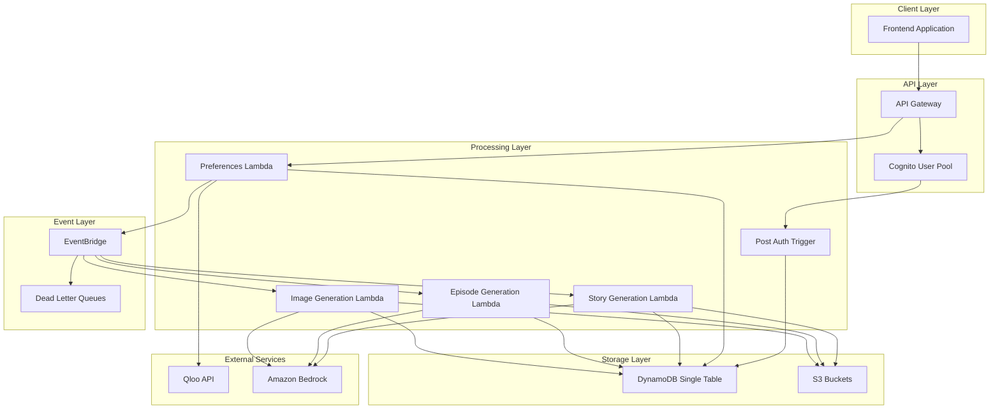
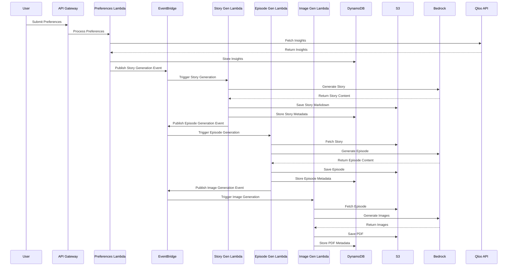

# Design Document

## Overview

The Manga Generation Platform is a serverless, event-driven application built on AWS that creates personalized manga content based on user preferences. The system follows microservices architecture principles with loose coupling through EventBridge, ensuring scalability and fault tolerance. The platform integrates with external APIs (Qloo) and leverages AI services (Amazon Bedrock) to generate stories and images, ultimately producing complete manga episodes in PDF format.

## Architecture

### High-Level Architecture



### Event Flow Architecture



## Components and Interfaces

### API Gateway Configuration

**REST API Endpoints:**

- `POST /preferences` - Submit user preferences for manga generation
- `GET /stories` - Retrieve user's generated stories
- `GET /stories/{storyId}` - Get specific story details
- `GET /episodes/{episodeId}` - Get specific episode
- `GET /status/{requestId}` - Check generation status

**Authentication:**

- Cognito User Pool Authorizer for all endpoints
- JWT token validation
- CORS configuration for frontend integration

### Lambda Functions

#### 1. Post Authentication Trigger

```typescript
interface PostAuthEvent {
  userPoolId: string;
  userName: string;
  request: {
    userAttributes: {
      email: string;
      sub: string;
    };
  };
}

interface UserRecord {
  PK: string; // USER#{userId}
  SK: string; // PROFILE
  GSI1PK: string; // USER#{userId}
  GSI1SK: string; // PROFILE
  email: string;
  createdAt: string;
  status: "ACTIVE" | "INACTIVE";
}
```

#### 2. Preferences Processing Lambda

```typescript
interface PreferencesRequest {
  genres: string[];
  themes: string[];
  artStyle: string;
  targetAudience: string;
  contentRating: string;
}

interface QlooInsights {
  recommendations: Array<{
    category: string;
    score: number;
    attributes: Record<string, any>;
  }>;
  trends: Array<{
    topic: string;
    popularity: number;
  }>;
}
```

#### 3. Story Generation Lambda

```typescript
interface StoryGenerationEvent {
  userId: string;
  requestId: string;
  preferences: PreferencesRequest;
  insights: QlooInsights;
}

interface BedrockStoryPrompt {
  model: "anthropic.claude-3-sonnet-20240229-v1:0";
  prompt: string;
  maxTokens: number;
  temperature: number;
}
```

#### 4. Episode Generation Lambda

```typescript
interface EpisodeGenerationEvent {
  userId: string;
  storyId: string;
  storyS3Key: string;
  episodeNumber: number;
}
```

#### 5. Image Generation Lambda

```typescript
interface ImageGenerationEvent {
  userId: string;
  episodeId: string;
  episodeS3Key: string;
}

interface BedrockImagePrompt {
  model: "stability.stable-diffusion-xl-v1";
  prompt: string;
  negativePrompt?: string;
  width: number;
  height: number;
}
```

### EventBridge Event Schemas

#### Story Generation Event

```json
{
  "source": "manga.preferences",
  "detail-type": "Story Generation Requested",
  "detail": {
    "userId": "string",
    "requestId": "string",
    "preferences": "object",
    "insights": "object",
    "timestamp": "string"
  }
}
```

#### Episode Generation Event

```json
{
  "source": "manga.story",
  "detail-type": "Episode Generation Requested",
  "detail": {
    "userId": "string",
    "storyId": "string",
    "storyS3Key": "string",
    "episodeNumber": "number",
    "timestamp": "string"
  }
}
```

#### Image Generation Event

```json
{
  "source": "manga.episode",
  "detail-type": "Image Generation Requested",
  "detail": {
    "userId": "string",
    "episodeId": "string",
    "episodeS3Key": "string",
    "timestamp": "string"
  }
}
```

## Data Models

### DynamoDB Single Table Design

**Table Name:** `MangaPlatformTable`

**Primary Key:**

- Partition Key (PK): Entity identifier
- Sort Key (SK): Entity type or relationship

**Global Secondary Index 1 (GSI1):**

- GSI1PK: Alternative access pattern
- GSI1SK: Alternative sort pattern

**Global Secondary Index 2 (GSI2):**

- GSI2PK: Status-based queries
- GSI2SK: Timestamp-based sorting

#### Entity Patterns

**User Profile:**

```
PK: USER#{userId}
SK: PROFILE
GSI1PK: USER#{userId}
GSI1SK: PROFILE
email: string
createdAt: ISO8601
status: ACTIVE|INACTIVE
preferences: object
```

**User Preferences:**

```
PK: USER#{userId}
SK: PREFERENCES#{timestamp}
GSI1PK: USER#{userId}
GSI1SK: PREFERENCES#{timestamp}
preferences: object
insights: object
createdAt: ISO8601
```

**Story:**

```
PK: USER#{userId}
SK: STORY#{storyId}
GSI1PK: STORY#{storyId}
GSI1SK: METADATA
GSI2PK: STATUS#{status}
GSI2SK: {createdAt}
title: string
s3Key: string
status: GENERATING|COMPLETED|FAILED
createdAt: ISO8601
updatedAt: ISO8601
```

**Episode:**

```
PK: STORY#{storyId}
SK: EPISODE#{episodeNumber}
GSI1PK: EPISODE#{episodeId}
GSI1SK: METADATA
GSI2PK: STATUS#{status}
GSI2SK: {createdAt}
episodeId: string
s3Key: string
pdfS3Key?: string
status: GENERATING|COMPLETED|FAILED
createdAt: ISO8601
```

**Generation Request:**

```
PK: USER#{userId}
SK: REQUEST#{requestId}
GSI1PK: REQUEST#{requestId}
GSI1SK: STATUS
GSI2PK: STATUS#{status}
GSI2SK: {createdAt}
type: STORY|EPISODE|IMAGE
status: PENDING|PROCESSING|COMPLETED|FAILED
createdAt: ISO8601
updatedAt: ISO8601
```

### S3 Bucket Structure

**Bucket Name:** `manga-platform-content-{environment}`

**Folder Structure:**

```
/stories/
  /{userId}/
    /{storyId}/
      story.md
/episodes/
  /{userId}/
    /{storyId}/
      /{episodeNumber}/
        episode.md
        episode.pdf
/images/
  /{userId}/
    /{storyId}/
      /{episodeNumber}/
        /generated/
          image-001.png
          image-002.png
```

## Error Handling

### Lambda Function Error Handling

**Retry Strategy:**

- Exponential backoff with jitter
- Maximum 3 retries for transient failures
- Dead Letter Queue for permanent failures

**Error Categories:**

1. **Transient Errors:** Network timeouts, service throttling
2. **Permanent Errors:** Invalid input, authorization failures
3. **Partial Failures:** Some operations succeed, others fail

**Error Response Format:**

```typescript
interface ErrorResponse {
  error: {
    code: string;
    message: string;
    details?: any;
    requestId: string;
    timestamp: string;
  };
}
```

### EventBridge Error Handling

**Dead Letter Queue Configuration:**

- Separate DLQ for each event type
- Maximum message retention: 14 days
- CloudWatch alarms for DLQ message count

**Event Replay Strategy:**

- Archive failed events for replay
- Manual intervention for critical failures
- Automated retry for transient failures

### External API Error Handling

**Qloo API:**

- Circuit breaker pattern
- Fallback to cached insights
- Rate limiting compliance

**Amazon Bedrock:**

- Model-specific error handling
- Content filtering compliance
- Token limit management

## Testing Strategy

### Unit Testing

**Lambda Functions:**

- Mock external dependencies (AWS SDK, Qloo API)
- Test business logic in isolation
- Validate error handling paths
- Test event parsing and validation

**Utilities and Helpers:**

- DynamoDB query builders
- S3 operations
- Event publishing logic
- Data transformation functions

### Integration Testing

**API Gateway Integration:**

- End-to-end API testing
- Authentication flow testing
- CORS validation
- Error response validation

**EventBridge Integration:**

- Event publishing and consumption
- Event schema validation
- Dead letter queue behavior
- Event ordering and deduplication

**AWS Service Integration:**

- DynamoDB operations with real table
- S3 file operations
- Bedrock model invocation
- Cognito authentication flow

### Load Testing

**Performance Targets:**

- API response time: < 5 seconds
- Concurrent users: 1000+
- Story generation: < 2 minutes
- Episode generation: < 1 minute
- Image generation: < 3 minutes

**Load Test Scenarios:**

- Gradual ramp-up testing
- Spike testing for traffic bursts
- Sustained load testing
- Failure recovery testing

### End-to-End Testing

**User Journey Testing:**

- Complete manga generation workflow
- Error recovery scenarios
- Multi-user concurrent testing
- Cross-browser compatibility

**Data Consistency Testing:**

- Event ordering validation
- State consistency across services
- Eventual consistency handling
- Conflict resolution testing

## Security Considerations

### Authentication and Authorization

**Cognito Configuration:**

- Strong password policies
- MFA support
- Account lockout policies
- JWT token expiration

**API Gateway Security:**

- Request validation
- Rate limiting per user
- IP whitelisting for admin endpoints
- Request/response logging

### Data Protection

**Encryption:**

- DynamoDB encryption at rest
- S3 bucket encryption (SSE-S3)
- Lambda environment variable encryption
- EventBridge event encryption

**Access Control:**

- Least privilege IAM policies
- Resource-based policies
- VPC endpoints for internal communication
- CloudTrail logging for audit

### Content Security

**Input Validation:**

- Request payload validation
- Content filtering for generated content
- File type validation for uploads
- Size limits for all inputs

**Output Sanitization:**

- Generated content review
- Inappropriate content detection
- Copyright compliance checking
- User-generated content moderation

## Monitoring and Observability

### CloudWatch Metrics

**Custom Metrics:**

- Generation success/failure rates
- Processing times per stage
- Queue depths and processing rates
- User engagement metrics

**AWS Service Metrics:**

- Lambda invocation counts and errors
- DynamoDB read/write capacity
- S3 request metrics
- API Gateway metrics

### Logging Strategy

**Structured Logging:**

- JSON format for all logs
- Correlation IDs across services
- User context in all operations
- Performance timing logs

**Log Aggregation:**

- CloudWatch Logs for centralization
- Log retention policies
- Log analysis with CloudWatch Insights
- Alert configuration for error patterns

### Alerting

**Critical Alerts:**

- Lambda function failures
- DynamoDB throttling
- External API failures
- Dead letter queue messages

**Performance Alerts:**

- High latency warnings
- Capacity utilization alerts
- Cost threshold alerts
- User experience degradation

## Deployment and Infrastructure

### CDK Stack Organization

**Core Infrastructure Stack:**

- DynamoDB table and indexes
- S3 buckets and policies
- EventBridge custom bus
- IAM roles and policies

**API Stack:**

- API Gateway configuration
- Cognito User Pool
- Lambda functions
- API documentation

**Monitoring Stack:**

- CloudWatch dashboards
- Alarms and notifications
- Log groups and retention
- X-Ray tracing configuration

### Environment Management

**Environment Separation:**

- Development, staging, production
- Environment-specific configurations
- Resource naming conventions
- Cross-environment promotion

**Configuration Management:**

- AWS Systems Manager Parameter Store
- Environment variables
- Feature flags
- Secret management with AWS Secrets Manager

### Deployment Pipeline

**CI/CD Strategy:**

- Automated testing on pull requests
- Staged deployments with approval gates
- Blue-green deployment for zero downtime
- Rollback capabilities

**Infrastructure Validation:**

- CDK synthesis validation
- Security scanning
- Cost estimation
- Compliance checking
