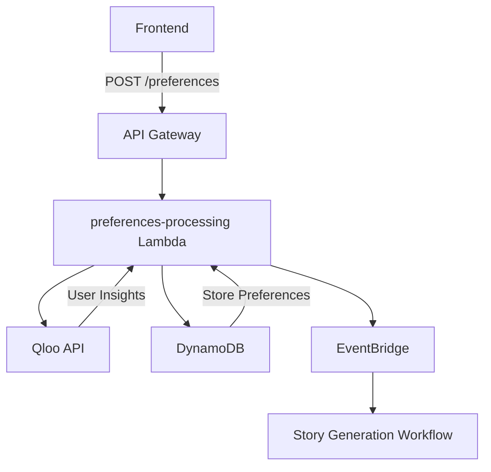
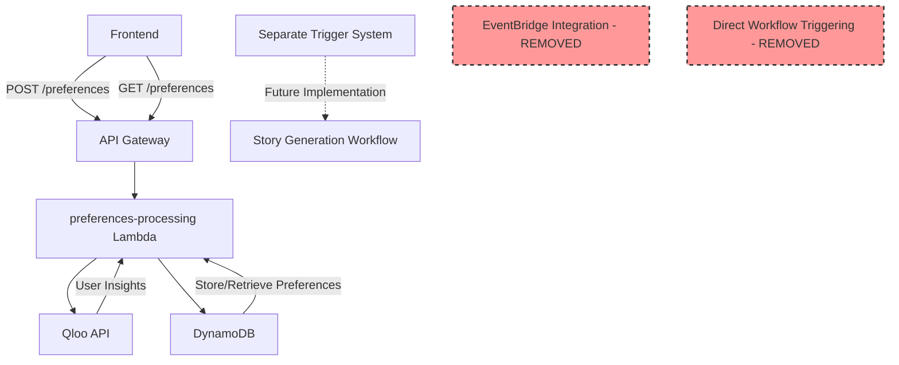

# Design Document

## Overview

This design refactors the `/preferences` API endpoint to improve separation of concerns and system modularity. The current preferences-processing lambda handles both preference storage and workflow triggering via EventBridge. This refactoring will:

1. Remove EventBridge integration from the preferences-processing lambda
2. Focus the lambda solely on storing user preferences from Qloo API to DynamoDB
3. Add a new GET endpoint to retrieve user preferences
4. Maintain all existing functionality except workflow triggering
5. Preserve the existing single table DynamoDB design and data structures

The refactored system will be more modular, with manga generation workflows triggered by a separate mechanism to be implemented later.

## Architecture

### Current Architecture (Before Refactoring)



### New Architecture (After Refactoring)



### Technology Stack

- **Lambda Runtime**: Node.js 20.x
- **Database**: DynamoDB with single table design
- **External API**: Qloo API for user insights
- **API Gateway**: REST API with Cognito authorization
- **Authentication**: AWS Cognito User Pools
- **Monitoring**: X-Ray tracing, CloudWatch metrics
- **Language**: TypeScript

## Components and Interfaces

### Updated Lambda Handler Interface

The preferences-processing lambda will support both GET and POST methods:

```typescript
interface PreferencesEvent extends APIGatewayProxyEvent {
  httpMethod: "GET" | "POST";
  requestContext: APIGatewayProxyEvent["requestContext"] & {
    authorizer?: {
      claims: {
        sub: string;
        email: string;
      };
    };
  };
}

interface PreferencesHandler {
  handlePost(event: PreferencesEvent): Promise<APIGatewayProxyResult>;
  handleGet(event: PreferencesEvent): Promise<APIGatewayProxyResult>;
}
```

### GET Endpoint Response Interface

```typescript
interface GetPreferencesResponse {
  success: true;
  data: {
    preferences: UserPreferencesData | null;
    insights?: QlooInsights;
    lastUpdated?: string;
  };
  requestId: string;
  timestamp: string;
}

interface EmptyPreferencesResponse {
  success: true;
  data: {
    preferences: null;
    message: "No preferences found for user";
  };
  requestId: string;
  timestamp: string;
}
```

### POST Endpoint Response Interface (Updated)

```typescript
interface PostPreferencesResponse {
  success: true;
  data: {
    message: "Preferences saved successfully";
    preferences: UserPreferencesData;
    insights: QlooInsights;
  };
  requestId: string;
  timestamp: string;
}
```

### Database Access Pattern Updates

The existing `UserPreferencesAccess` class will be enhanced with additional methods:

```typescript
class UserPreferencesAccess {
  // Existing methods
  static async create(
    userId: string,
    preferences: UserPreferences
  ): Promise<void>;
  static async getLatest(userId: string): Promise<UserPreferences | null>;
  static async getHistory(
    userId: string,
    limit?: number
  ): Promise<UserPreferences[]>;

  // New method for GET endpoint
  static async getLatestWithMetadata(userId: string): Promise<{
    preferences: UserPreferencesData | null;
    insights?: QlooInsights;
    lastUpdated?: string;
  }>;
}
```

## Data Models

### Existing Data Models (Unchanged)

The existing DynamoDB single table design and data models remain unchanged:

```typescript
// UserPreferences Entity (unchanged)
interface UserPreferences extends BaseEntity {
  PK: `USER#${string}`; // USER#{userId}
  SK: `PREFERENCES#${string}`; // PREFERENCES#{timestamp}
  GSI1PK: `USER#${string}`; // USER#{userId}
  GSI1SK: `PREFERENCES#${string}`; // PREFERENCES#{timestamp}
  preferences: UserPreferencesData;
  insights?: QlooInsights;
}

// UserPreferencesData (unchanged)
interface UserPreferencesData {
  genres: string[];
  themes: string[];
  artStyle: string;
  targetAudience: string;
  contentRating: string;
}

// QlooInsights (unchanged)
interface QlooInsights {
  recommendations: Array<{
    category: string;
    score: number;
    attributes: Record<string, any>;
  }>;
  trends: Array<{
    topic: string;
    popularity: number;
  }>;
}
```

### API Gateway Configuration Updates

The existing API Gateway configuration will be updated to support GET method:

```typescript
// Add GET method to preferences resource
preferencesResource.addMethod(
  "GET",
  new apigateway.LambdaIntegration(preferencesLambda, {
    proxy: true,
  }),
  {
    authorizer,
    authorizationType: apigateway.AuthorizationType.COGNITO,
    methodResponses: [
      {
        statusCode: "200",
        responseModels: {
          "application/json": successResponseModel,
        },
      },
      {
        statusCode: "401",
        responseModels: {
          "application/json": errorResponseModel,
        },
      },
      {
        statusCode: "404",
        responseModels: {
          "application/json": errorResponseModel,
        },
      },
      {
        statusCode: "500",
        responseModels: {
          "application/json": errorResponseModel,
        },
      },
    ],
  }
);
```

## Error Handling

### Error Response Format (Unchanged)

The existing error response format will be maintained for consistency:

```typescript
interface ErrorResponse {
  error: {
    code: string;
    message: string;
    requestId?: string;
    timestamp: string;
  };
}
```

### Error Scenarios

#### GET Endpoint Errors

1. **User Not Authenticated (401)**

   - Code: `UNAUTHORIZED`
   - Message: "User not authenticated"

2. **No Preferences Found (200 with empty data)**

   - Success response with `preferences: null`
   - Not treated as an error condition

3. **Database Error (500)**
   - Code: `DATABASE_ERROR`
   - Message: "Failed to retrieve preferences"

#### POST Endpoint Errors (Updated)

1. **Validation Errors (400)**

   - Code: `VALIDATION_ERROR`
   - Message: Specific validation error details

2. **Qloo API Error (500)**

   - Code: `QLOO_API_ERROR`
   - Message: "Failed to process user preferences"

3. **Database Error (500)**
   - Code: `DATABASE_ERROR`
   - Message: "Failed to save preferences"

**Removed Error Scenarios:**

- EventBridge publishing errors (no longer applicable)

## Testing Strategy

### Unit Testing

1. **Lambda Handler Tests**

   - Test GET method with existing preferences
   - Test GET method with no preferences
   - Test POST method without EventBridge integration
   - Test error handling for both methods

2. **Database Access Tests**

   - Test `getLatestWithMetadata` method
   - Test existing methods remain functional
   - Test error scenarios

3. **Qloo API Integration Tests**
   - Test existing Qloo integration remains functional
   - Test error handling

### Integration Testing

1. **API Gateway Integration**

   - Test GET /preferences endpoint
   - Test POST /preferences endpoint
   - Test authentication and authorization
   - Test CORS configuration

2. **End-to-End Testing**
   - Test complete preference submission flow
   - Test preference retrieval flow
   - Test error scenarios

### Regression Testing

1. **Existing Functionality**

   - Verify POST endpoint still works correctly
   - Verify preference storage functionality
   - Verify Qloo API integration
   - Verify authentication and validation

2. **Removed Functionality**
   - Verify EventBridge events are no longer published
   - Verify no workflow triggering occurs

## Security Considerations

### Authentication and Authorization (Unchanged)

- Cognito User Pool authentication required for both endpoints
- User can only access their own preferences
- JWT token validation

### Input Validation (Unchanged for POST, New for GET)

- POST: Existing validation rules maintained
- GET: No request body validation needed
- Path parameter validation for user context

### Data Privacy

- Users can only retrieve their own preferences
- No cross-user data access
- Secure token handling

## Performance Optimization

### Database Access Patterns

- GET endpoint uses existing efficient query pattern
- Single query to retrieve latest preferences
- Minimal data transfer

### Caching Considerations

- Consider adding response caching for GET endpoint
- Cache invalidation on preference updates
- CloudFront caching for static responses

### Lambda Performance

- Existing memory and timeout configurations maintained
- Cold start optimization through bundling
- X-Ray tracing for performance monitoring

## Deployment Strategy

### Backward Compatibility

- Existing POST endpoint functionality preserved
- No breaking changes to request/response formats
- Gradual rollout possible

### Infrastructure Changes

1. **API Gateway Updates**

   - Add GET method to preferences resource
   - Update CORS configuration if needed
   - Add new method responses

2. **Lambda Function Updates**

   - Update handler to support both GET and POST
   - Remove EventBridge integration code
   - Add new database access methods

3. **IAM Permission Updates**
   - Remove EventBridge permissions from lambda role
   - Maintain existing DynamoDB and Qloo API permissions

### Rollback Strategy

- Keep EventBridge integration code commented out initially
- Ability to quickly re-enable if needed
- Database schema unchanged for easy rollback

## Monitoring and Observability

### Metrics (Updated)

- **Existing Metrics**: Preference submission success/failure rates
- **New Metrics**: Preference retrieval success/failure rates
- **Removed Metrics**: EventBridge publishing metrics

### Logging (Updated)

- **Enhanced Logging**: Add GET endpoint request/response logging
- **Existing Logging**: Maintain POST endpoint logging
- **Removed Logging**: EventBridge publishing logs

### Alarms

- Update existing alarms to account for new GET endpoint
- Remove EventBridge-related alarms
- Add new alarms for preference retrieval failures

## Migration Plan

### Phase 1: Code Changes

1. Update lambda handler to support GET method
2. Remove EventBridge integration code
3. Add new database access methods
4. Update unit tests

### Phase 2: Infrastructure Updates

1. Deploy updated lambda function
2. Update API Gateway configuration
3. Update IAM permissions
4. Deploy to staging environment

### Phase 3: Testing and Validation

1. Run comprehensive test suite
2. Validate both GET and POST endpoints
3. Verify EventBridge integration is removed
4. Performance testing

### Phase 4: Production Deployment

1. Deploy to production
2. Monitor metrics and logs
3. Validate functionality
4. Update documentation

## Future Considerations

### Workflow Triggering

- Design separate system for manga generation triggering
- Consider event-driven architecture with different trigger mechanisms
- Potential integration points for future workflow system

### API Enhancements

- Consider adding PATCH endpoint for partial preference updates
- Potential preference versioning and history endpoints
- Bulk preference operations

### Performance Improvements

- Response caching strategies
- Database query optimization
- Potential read replicas for high-traffic scenarios
